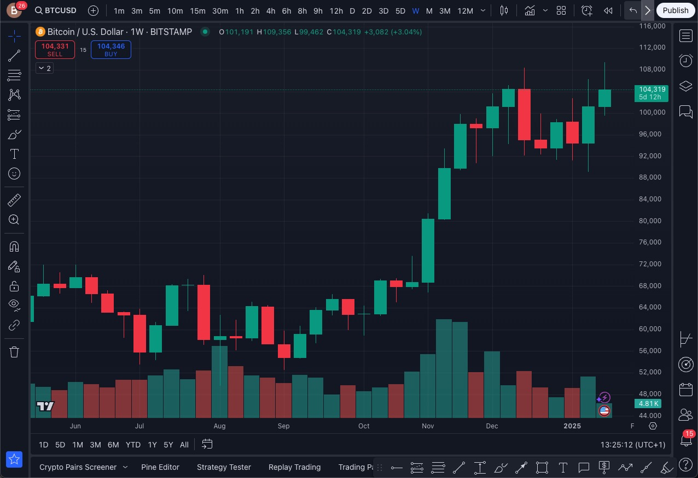
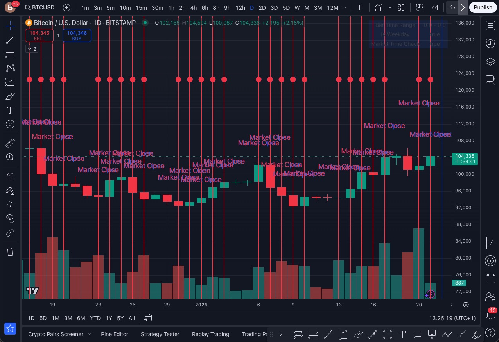
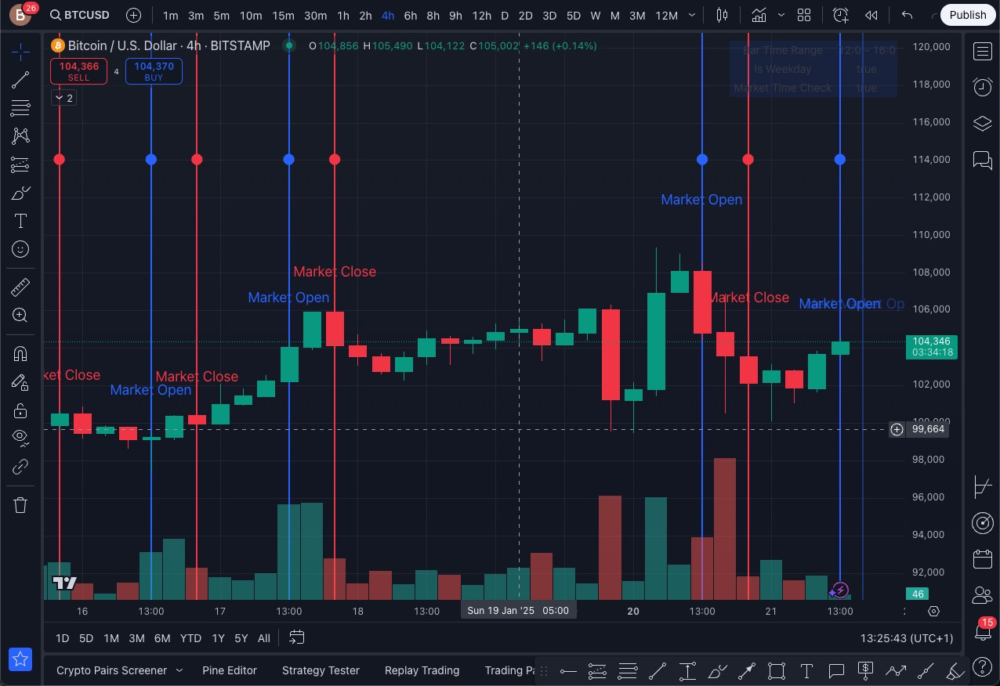
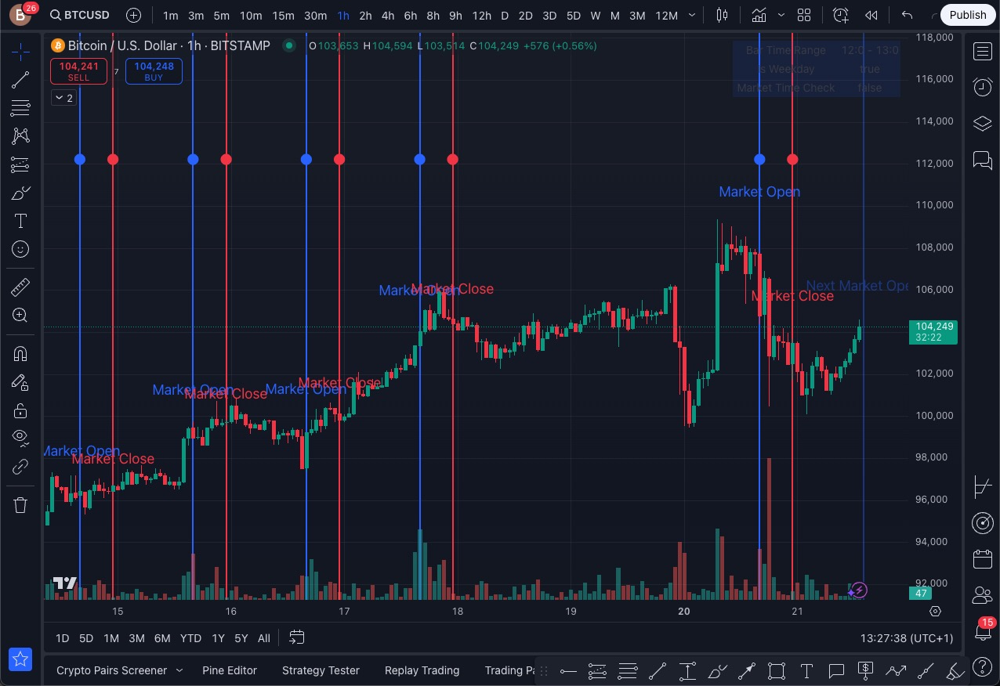
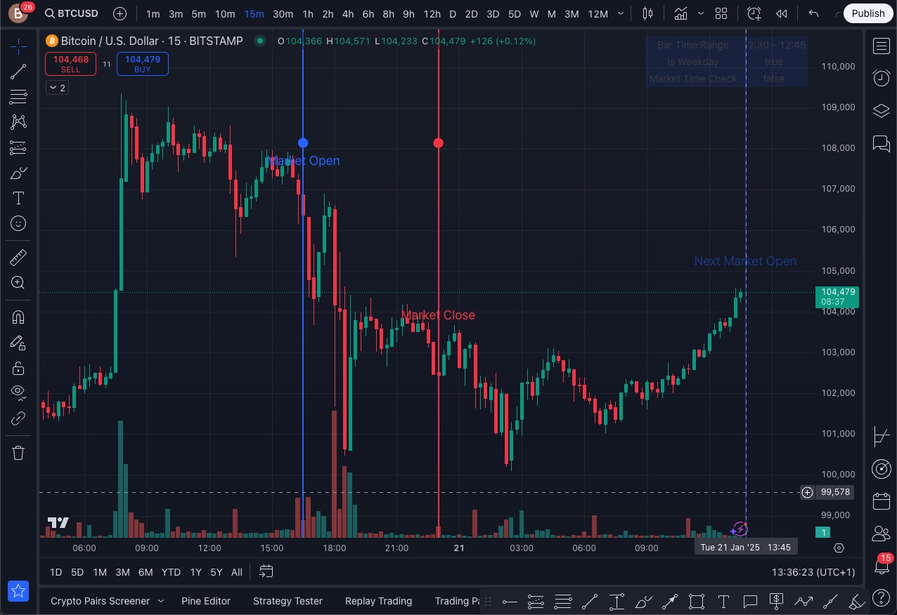

# NYSE Market Time Indicators for TradingView

A Pine Script indicator that displays NYSE market open and close times on TradingView charts, automatically adjusting to your local timezone.

## Screenshots

### Weekly Timeframe View

*Market open/close lines shown on weekly chart*

### Daily Timeframe View

*Market open/close lines with next event indicator on daily chart*

### 4-Hour Timeframe View

*Detailed view of market events on 4-hour chart*

### 1-Hour Timeframe View

*Precise market timing on 1-hour chart*

### 15-Minute Timeframe View

*High precision view of market events on 15-minute chart*

## Features

- Displays vertical lines at NYSE market open (14:30 local time) and close (21:00 local time)
- Shows both historical market events and the next upcoming market open/close
- Next market events are shown with semi-transparent lines and "Next" labels
- Automatically skips weekends when calculating next market events
- Works across all timeframes (1m to Monthly)
- Customizable appearance for both open and close indicators
- Debug information showing time ranges and market status
- Visual confirmation dots at the top of the chart
- Only shows indicators on weekdays (Monday-Friday)

## Installation

1. Open TradingView chart
2. Click "Pine Editor" (Alt+P)
3. Copy and paste the script content
4. Click "Save" and then "Add to Chart"

## Settings

### Open Line Settings
- Line Color: Color of the market open line (default: blue)
- Width: Line thickness (1-4 pixels)
- Style: Line style (solid, dashed, or dotted)

### Close Line Settings
- Line Color: Color of the market close line (default: red)
- Width: Line thickness (1-4 pixels)
- Style: Line style (solid, dashed, or dotted)

### Label Settings
- Show Labels: Toggle visibility of "Market Open" and "Market Close" labels
- Size: Label text size (small, normal, or large)

## Debug Information

The indicator includes a debug panel showing:
- Current bar's time range
- Whether it's a weekday
- Market time check status

## Versions

Two versions are available:
1. `NYSE_Market_Open_Lines.pine`: Basic version with only market open indicators
2. `NYSE_Market_Open_Lines_with_Labels.pine`: Full version with both open and close indicators, plus labels

## Usage Tips

- Use smaller timeframes (15m or less) for precise timing
- The indicator works on any timeframe by detecting if the market time falls within the bar's range
- Blue dots indicate market open times, red dots indicate market close times
- Lines extend beyond the chart for better visibility
- Semi-transparent lines indicate upcoming market events
- "Next Market Open/Close" labels help distinguish future events from historical ones

## Notes

- Times are displayed in your local timezone (14:30 for market open, 21:00 for market close)
- Indicators only appear on weekdays
- Historical data will show all previous market open/close lines
- Next market events automatically adjust for weekends, skipping to the next trading day

## Market Hours Information

The New York Stock Exchange (NYSE) is open for 6.5 hours per trading day.

Regular Trading Hours:
	•	Start: 9:30 AM Eastern Time (ET)
	•	End: 4:00 PM Eastern Time (ET)

Total Duration:

4:00 PM - 9:30 AM = 6 hours 30 minutes (6.5 hours).

---

Zurich is typically in the Central European Time (CET) zone, which is 6 hours ahead of Eastern Time (ET) during standard time and 5 hours ahead during daylight saving time.

NYSE Hours in Zurich Time:
	1.	Standard Time (late fall to early spring):
	•	NYSE opens at 3:30 PM Zurich time.
	•	NYSE closes at 10:00 PM Zurich time.
	2.	Daylight Saving Time (spring to late fall):
	•	NYSE opens at 2:30 PM Zurich time.
	•	NYSE closes at 9:00 PM Zurich time.

Notes:
	•	The U.S. and Europe don't switch between standard and daylight saving time on the same dates, so there are a few weeks of overlap where the difference might temporarily shift.
	•	If you're working with TradingView, it will automatically adjust the displayed hours according to your local time settings.